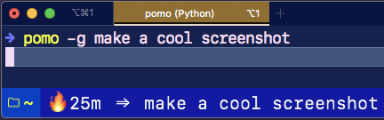

# statusbar-pomodoro
A cute little pomodoro timer in your iTerm2 status bar.



Supports:
- Setting a goal.
- Cancelling an in progress pomodoro.
- Setting custom work and rest times.


## Usage
It's recommended you run `pomo` as a detached background process by calling it with `nohup pomo -g "your inspirational goal" &> /dev/null &`
- Starting the timer
    - with a goal: `$ pomo -g get stuff done`
    - with no goal: `$ pomo`
    - with custom work / rest times: `$ pomo --work 30 --rest 10`
- Stopping the timer
    - `$ pomo -s`
- Disabling the creepy voice
    - `$ pomo -q`

```
usage: pomo [-h] [-s] [-g GOAL [GOAL ...]] [--work WORK] [--rest REST]
            [--debug]

A pomodoro timer!

optional arguments:
  -h, --help            show this help message and exit
  -s, --stop            Your current goal
  -g GOAL [GOAL ...], --goal GOAL [GOAL ...]
                        Your current goal
  --work WORK           length of the working session (minutes)
  --rest REST           length of the resting session (minutes)
  --debug               enable debugging mode
```

## Install
1. `$ git clone https://github.com/slin63/statusbar-pomodoro && cd statusbar-pomodoro`
    - Clone this repo
1. `$ ln -si pomo.py $HOME/Library/Application Support/iTerm2/Scripts/AutoLaunch/pomo.py`
    - Link the statusbar component to your iTerm2 scripts directory
1. `$ ln -si pomo /usr/local/bin/pomo`
    - Put `pomo` into your `$PATH`
1. iTerm2 preferences > Session > Configure Status Bar > add Pomo Timer
    - Add the pomo timer to your status bar
1. `$ pomo -g celebrate!`
    - Try it out!


